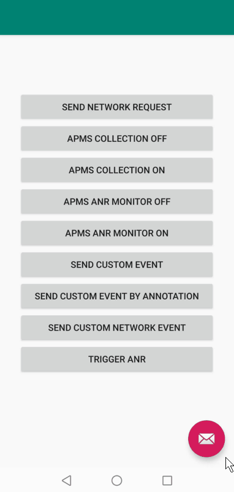

# APMS演示

##目录

*【导言】（#导言）
*【准备环境】（#准备环境）
*【入门】（#入门）
*【示例代码】（#示例代码）
*【结果】（#结果）
*【问题或问题】（#问题或问题）
*【许可证】（#许可证）

##简介
通过帮助您发现和纠正应用程序性能问题，帮助您改善应用程序的用户体验。

##准备环境
*安装了Android Studio的计算机，用于应用程序开发
*Android Studio中运行Android 4.2或更高版本的设备或模拟器

##入门
在运行apms快速启动应用程序之前，您需要：
1、如果您没有华为开发者联盟帐户，您需要【注册帐户】（https://developer.huawei.com/consumer/en/doc/start/registration-and-verification-0000001053628148） 并通过身份验证。
2、使用您的帐户登录【应用市场连接】（https://developer.huawei.com/consumer/cn/doc/development/AppGallery-connect-Guides/agc-get-started） ，创建应用，并将软件包类型设置为APK（Android应用）。
3、在我的项目中选择您的项目和应用，进入质量> APMS，启用APMS服务。
4、选择项目设置，从AppGallery Connect下载agconnect-services.json文件，并将agconnect-services.json文件复制到应用根目录。

##示例代码
APMS SDK支持自动采集性能数据和设置采集开关。

示例代码：src\main\java\com\example\quickstart\apmsandroiddemo\MainActivity.java

##结果
**报告APMS数据** 

##问题或问题
如果您对如何使用AppGallery Connect演示有疑问，请尝试以下选项：
*【堆栈溢出】（https://stackoverflow.com/users/14194729/appgallery-connect） 是任何编程问题的最佳地点。请务必将您的问题标记为huawei-移动服务。
*【华为开发者论坛】(https://forums.developer.huawei.com/forumPortal/en/home?fid=0101188387844930001) AppGallery 模块非常适合一般问题，或寻求建议和意见。

如果您在我们的示例中遇到错误，请向存储库提交【问题】（https://github.com/AppGalleryConnect/agc-demos/issues）。 更好的是，您可以提交带有修复程序的【拉取请求】（https://github.com/AppGalleryConnect/agc-demos/pulls）。

##许可证
apms快速启动在【Apache许可证，版本2.0】（http://www.apache.org/licenses/LICense-2.0） 下获得许可。

